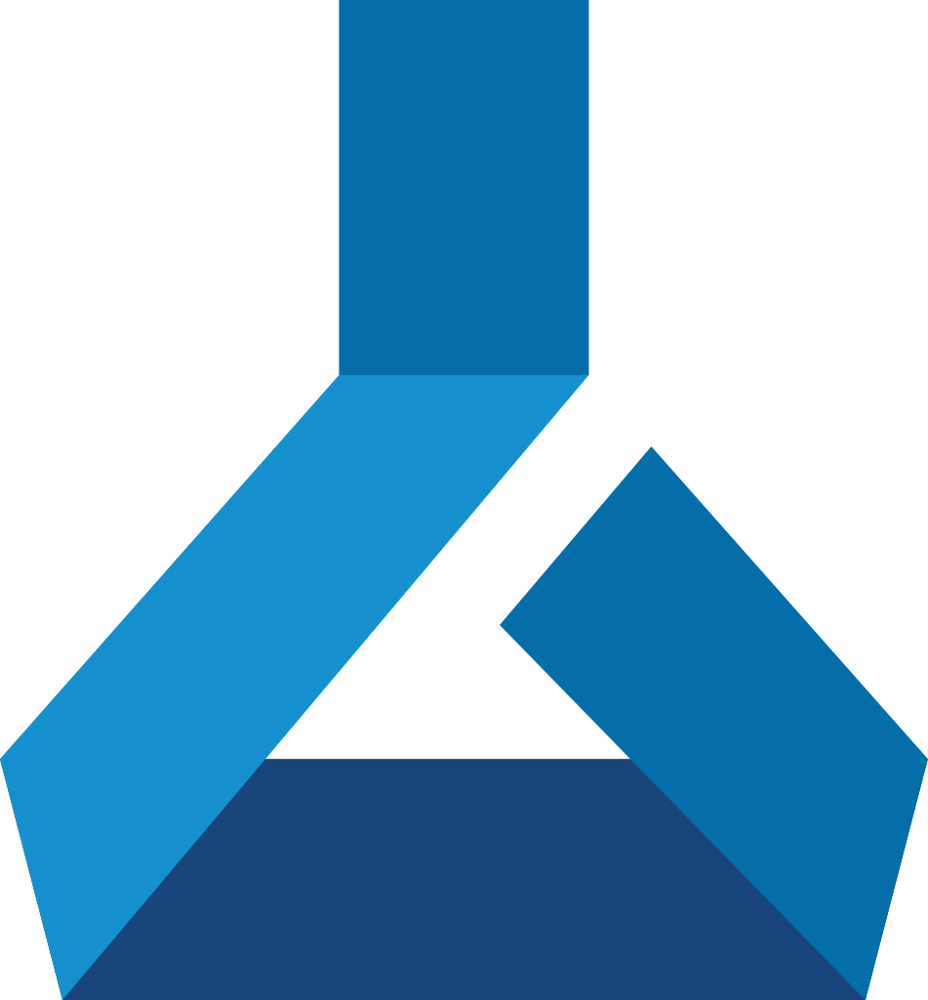

# MLOps Example with Castanets and Azure ML Studio

  
  
  

Used template: [machine-learning-apps/ml-template-azure](https://github.com/machine-learning-apps/ml-template-azure)

## Castanets Demo

**Check this Issue: [#6 [Castanets] Iris Model Training (v5)](https://github.com/team-castanets/mlops-example/issues?q=is%3Aissue+is%3Aclosed)**

# What is MLOps?

  

MLOps empowers data scientists and machine learning engineers to bring together their knowledge and skills to simplify the process of going from model development to release/deployment. ML Ops enables you to track, version, test, certify and reuse assets in every part of the machine learning lifecycle and provides orchestration services to streamline managing this lifecycle. This allows practitioners to automate the end to end machine Learning lifecycle to frequently update models, test new models, and continuously roll out new ML models alongside your other applications and services.

This repository enables Data Scientists to focus on the training and deployment code of their machine learning project (`code` folder of this repository). Once new code is checked into the `code` folder of the master branch of this repository the GitHub workflow is triggered and open source Azure Machine Learning actions are used to automatically manage the training through to deployment phases.
